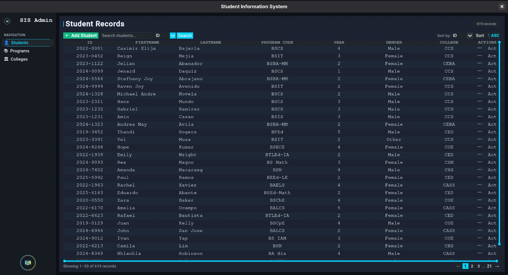
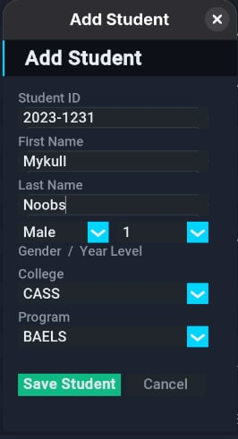
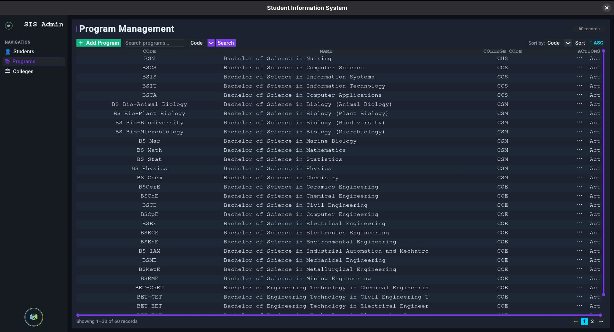
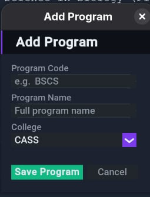
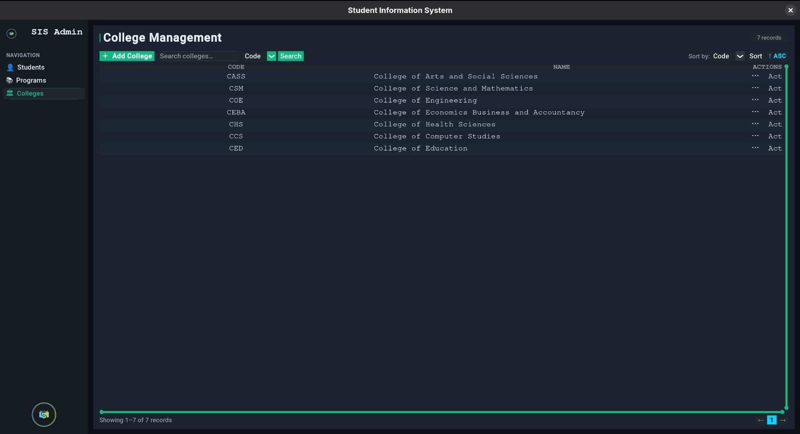
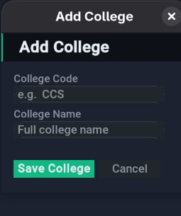

# 🎓 Simple Student Information System (SIS)

A desktop application for managing student, program, and college records — built with Python and CustomTkinter.

---

## ✨ Features

### 👤 Student Management
- Add, edit, and delete student records
- Fields: Student ID, First Name, Last Name, Program, Year Level, Gender
- College is automatically resolved from the student's enrolled program
- Student ID is validated against the format `YYYY-NNNN`

### 📚 Program Management
- Add, edit, and delete academic programs
- Each program is linked to a college
- Deleting a program marks affected students as **unassigned** (non-destructive)
- Re-adding a deleted program **automatically re-links** previously unassigned students

### 🏛 College Management
- Add, edit, and delete colleges
- Deleting a college cascades: affected programs and their students are marked unassigned
- Re-adding a deleted college **fully restores** the cascade — programs and students are re-linked

### 🔍 Search & Filter
- Search by any column (ID, name, program, year, gender, college)
- Starts-with matching for fast lookups

### ↕️ Sorting
- Sort any column ascending or descending
- Toggle button switches between `↑ ASC` and `↓ DESC`

### 📄 Pagination
- Dynamic rows-per-page based on window height
- Page number buttons with `…` ellipsis for large datasets
- Live record count badge in the header

### 🗃 Data Persistence
- All data stored as plain `.csv` files — no database required
- Files are human-readable and portable

---

## 🖥 Tech Stack

| Layer | Technology |
|-------|------------|
| GUI Framework | [CustomTkinter](https://github.com/TomSchimansky/CustomTkinter) |
| Table/Treeview | `tkinter.ttk.Treeview` |
| Image Handling | [Pillow (PIL)](https://pillow.readthedocs.io/) |
| Data Storage | CSV files via Python's `csv` module |
| Validation | Custom regex-based validators |
| Language | Python 3 |

---

## 📁 Project Structure

```
Simple-Student-Information/
├── main.py                  # Entry point
├── data/
│   ├── students.csv         # Student records
│   ├── programs.csv         # Program records
│   └── colleges.csv         # College records
├── assets/
│   ├── logo.png             # App logo (sidebar + window icon)
│   └── screenshots/         # UI screenshots for documentation
├── gui/
│   ├── main_window.py       # Main window, sidebar, treeview, pagination
│   ├── student_forms.py     # Add/Edit/Delete student forms
│   ├── programs_forms.py    # Add/Edit/Delete program forms
│   └── college_forms.py     # Add/Edit/Delete college forms
└── modules/
    ├── database_io.py       # CSV read/write/search/sort utilities
    └── validators.py        # Input validation for all entities
```

---

## 🚀 Getting Started

### 1. Clone the repository
```bash
git clone https://github.com/yourusername/Simple-Student-Information.git
cd Simple-Student-Information
```

### 2. Create and activate a virtual environment
```bash
python -m venv .venv
source .venv/bin/activate        # Linux / macOS
.venv\Scripts\activate           # Windows
```

### 3. Install dependencies
```bash
pip install customtkinter pillow
```

### 4. Run the app
```bash
python main.py
```

---

## ✅ Validation Rules

### Student
| Field | Rule |
|-------|------|
| ID | Format `YYYY-NNNN`, year between 2000 and current year, no duplicates |
| First / Last Name | 2–64 characters, letters only (spaces, hyphens, apostrophes, dots allowed) |
| Year Level | Integer between 1 and 5 |
| Gender | Male, Female, or Other |
| Program | Must exist in the programs list |

### Program
| Field | Rule |
|-------|------|
| Code | Letters, numbers, hyphens, spaces — max 32 characters, no duplicates |
| Name | 5–128 characters, not numbers only |
| College | Must exist in the colleges list |

### College
| Field | Rule |
|-------|------|
| Code | Letters only — at least 2 characters, max 16, no duplicates |
| Name | 5–128 characters, not numbers only |

---

## 🗄 Soft-Delete Cascade

When a college or program is deleted, dependent records are **not permanently broken** — they are prefixed with `__deleted__<code>` so they can be restored automatically when the college/program is re-added.

```
Delete college CCS  →  programs: college_code = "__deleted__CCS"
                    →  students: program_code = "__deleted__BSCS"

Re-add college CCS  →  programs: college_code = "CCS"  ✅ restored
                    →  students: program_code = "BSCS"  ✅ restored
```

---

## 📸 Screenshots

> **Note:** Screenshots were taken on Linux. The UI appearance (fonts, window decorations) may differ slightly on Windows.

### Student Records


### Add Student Form


### Program Management


### Add Program Form


### College Management


### Add College Form


---
## 📋 Sample Colleges

| Code | College |
|------|---------|
| CCS | College of Computer Studies |
| COE | College of Engineering |
| CSM | College of Science and Mathematics |
| CED | College of Education |
| CEBA | College of Economics, Business and Accountancy |
| CASS | College of Arts and Social Sciences |
| CHS | College of Health Sciences |
