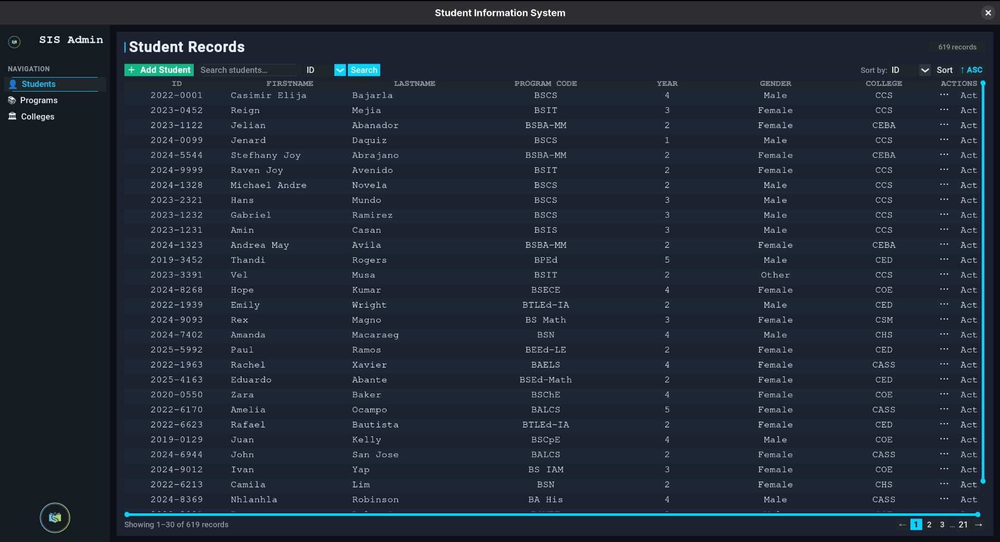
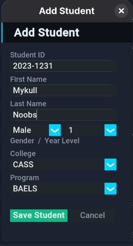
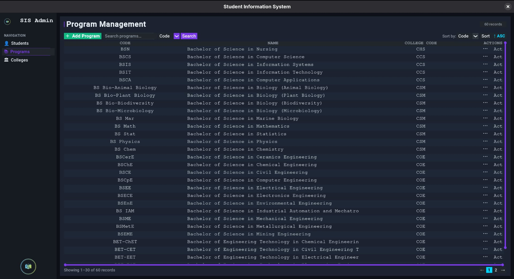
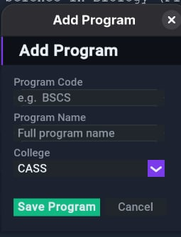
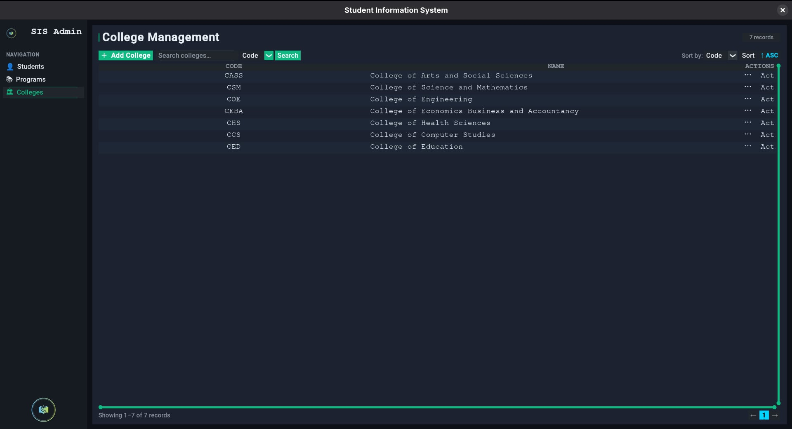
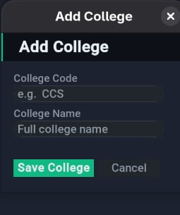

# 🎓 Simple Student Information System (SIS)

A desktop application for managing student, program, and college records — built with Python, CustomTkinter, and SQLite.

---

## ✨ Features

### 👤 Student Management
- Add, edit, and delete student records
- Fields: Student ID, First Name, Last Name, Course, Year Level, Gender
- College is automatically resolved from the student's enrolled program
- Student ID is validated against the format `YYYY-NNNN`
- Student names are normalized before saving

### 📚 Program Management
- Add, edit, and delete academic programs
- Each program is linked to a college
- Program and college codes are validated before saving

### 🏛 College Management
- Add, edit, and delete colleges
- College codes are validated before saving

### 🔍 Search & Filter
- Search by any column (ID, name, course, year, gender, college)
- Partial matching for fast lookups

### ↕️ Sorting
- Sort any column ascending or descending
- Toggle button switches between `↑ ASC` and `↓ DESC`

### 📄 Pagination
- Dynamic rows-per-page based on window height
- Page number buttons with `…` ellipsis for large datasets
- Live record count badge in the header

### 💾 Backup & Restore
- Backup and restore tools are built into the sidebar
- Backups are written to `data/backups/`
- Restores verify database integrity before and after replacement

### 🗃 Data Persistence
- Data is stored in a local SQLite database (`data/sis_database.db`)
- CSV files are still used for migration/import/export workflows

---

## 🖥 Tech Stack

| Layer | Technology |
|-------|------------|
| GUI Framework | [CustomTkinter](https://github.com/TomSchimansky/CustomTkinter) |
| Table/Treeview | `tkinter.ttk.Treeview` |
| Image Handling | [Pillow (PIL)](https://pillow.readthedocs.io/) |
| Data Storage | SQLite (`sqlite3`) + CSV import/export |
| Validation | Custom regex-based validators |
| Language | Python 3 |

---

## 📁 Project Structure

```
Simple-Student-Information-SQLITE/
├── main.py                  # Preferred entry point
├── data/
│   ├── students.csv         # Student records
│   ├── programs.csv         # Program records
│   └── colleges.csv         # College records
├── assets/
│   ├── logo.png             # App logo (sidebar + window icon)
│   └── screenshots/         # UI screenshots for documentation
├── gui/
│   ├── main_window.py       # Main window, sidebar, treeview, pagination
│   ├── student_forms.py     # Add/Edit/Delete student forms
│   ├── programs_forms.py    # Add/Edit/Delete program forms
│   └── college_forms.py     # Add/Edit/Delete college forms
└── modules/
    ├── database_io.py       # SQLite helpers, CSV import/export, backup/restore
    └── validators.py        # Input validation and normalization for all entities
```

---

## 🚀 Getting Started

### 1. Open the project folder
Clone the repository and open the generated folder (same as the repo link name).

```bash
git clone https://github.com/Michael-Andre-Novela/Simple-Student-Information-SQLITE.git
cd Simple-Student-Information-SQLITE
```

If you already have the project locally, just open that folder directly and run:

```bash
cd /path/to/your/Simple-Student-Information-SQLITE
```

### 2. Create and activate a virtual environment
```bash
python -m venv .venv
source .venv/bin/activate        # Linux / macOS
.venv\Scripts\activate           # Windows
```

### 3. Install dependencies
```bash
pip install customtkinter pillow
```

### 4. Run the app
```bash
python main.py
```

If you want to launch the window module directly, you can also run:

```bash
python gui/main_window.py
```

---

## ✅ Validation Rules

## 🧱 Database Schema (Final)

### student
- `id` (format: `YYYY-NNNN`)
- `firstname`
- `lastname`
- `course` → refers to `program.code`
- `year`
- `gender`

### program
- `code` (e.g., `BSCS`)
- `name` (e.g., `Bachelor of Science in Computer Science`)
- `college` → refers to `college.code`

### college
- `code` (e.g., `CCS`)
- `name` (e.g., `College of Computer Studies`)

### Student
| Field | Rule |
|-------|------|
| ID | Format `YYYY-NNNN`, year between 2000 and current year, no duplicates |
| First / Last Name | 2–64 characters, letters only (spaces, hyphens, apostrophes, dots allowed) |
| Year Level | Integer between 1 and 5 |
| Gender | Male, Female, or Other |
| Course | Must exist in the programs list |

### Data Normalization
- Student names are normalized (trim extra spaces, title-case words)
- Program and college data are trimmed before validation
- Duplicate student profile checks are enforced for regular create/update flows

---

## 🧪 CSV Pre-Validation

- `validate_csv_rows(table_name, filename)` validates all rows before import
- Returns tuple: `(is_valid, errors, normalized_rows)`
- Errors include row number, field, and message
- `import_table(...)` aborts with `ValueError` when validation fails

Example error payload:

```python
{"row": 12, "field": "year", "message": "Year level must be between 1 and 5."}
```

---

## 💾 Backup & Restore

- `backup_database(destination_path=None)` creates SQLite backups
    - default location: `data/backups/sis_backup_YYYYMMDD_HHMMSS.db`
- `restore_database(backup_path)` restores the DB from a backup
- Both backup and restored DB files run `PRAGMA integrity_check`

### Program
| Field | Rule |
|-------|------|
| Code | Letters, numbers, hyphens, spaces — max 32 characters, no duplicates |
| Name | 5–128 characters, not numbers only |
| College | Must exist in the colleges list |

### College
| Field | Rule |
|-------|------|
| Code | Letters only — at least 2 characters, max 16, no duplicates |
| Name | 5–128 characters, not numbers only |

---

## 📸 Screenshots

> **Note:** Screenshots were taken on Linux. The UI appearance (fonts, window decorations) may differ slightly on Windows.

### Student Records


### Add Student Form


### Program Management


### Add Program Form


### College Management


### Add College Form


---
## 📋 Sample Colleges

| Code | College |
|------|---------|
| CCS | College of Computer Studies |
| COE | College of Engineering |
| CSM | College of Science and Mathematics |
| CED | College of Education |
| CEBA | College of Economics, Business and Accountancy |
| CASS | College of Arts and Social Sciences |
| CHS | College of Health Sciences |
